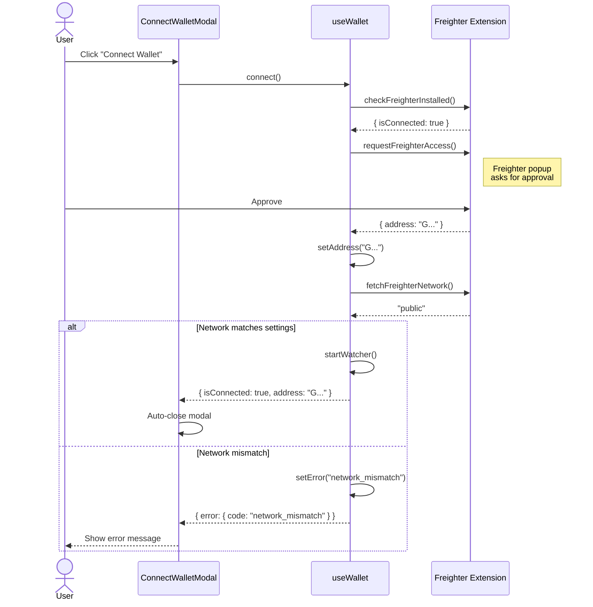
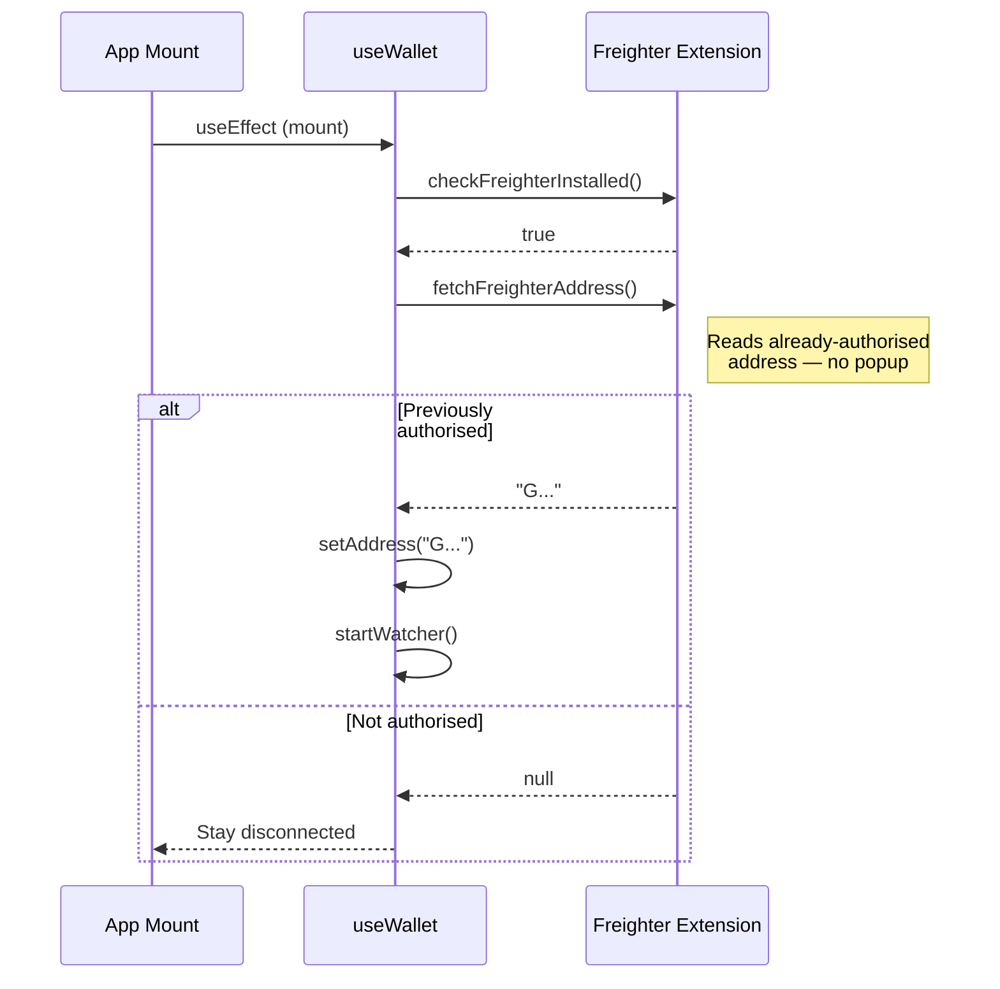
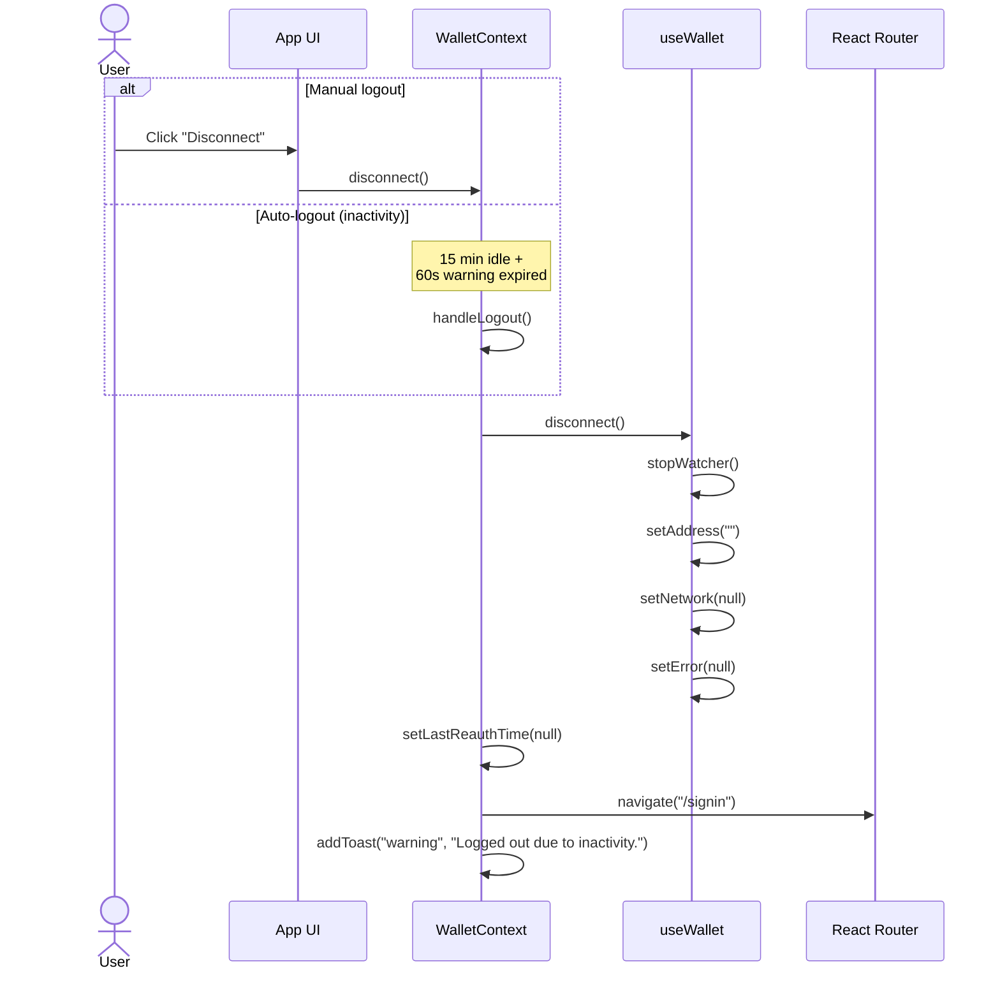
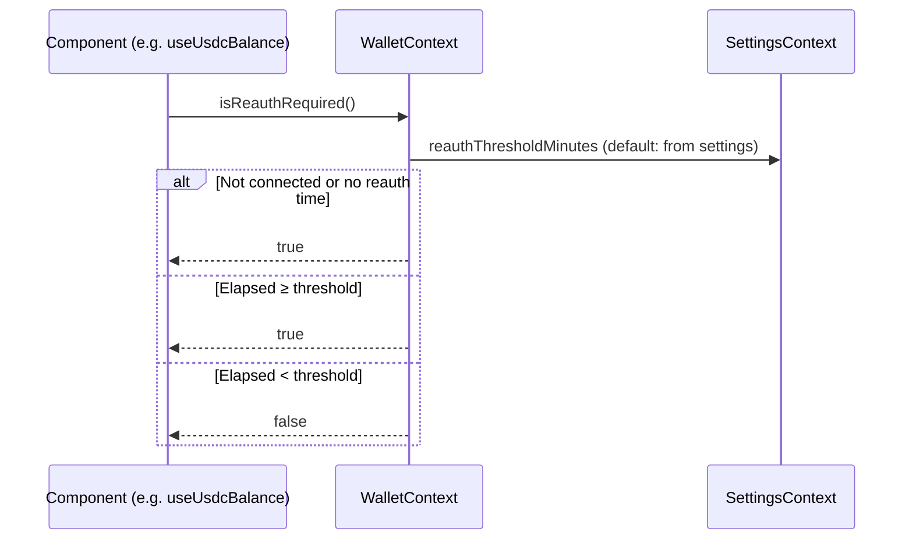
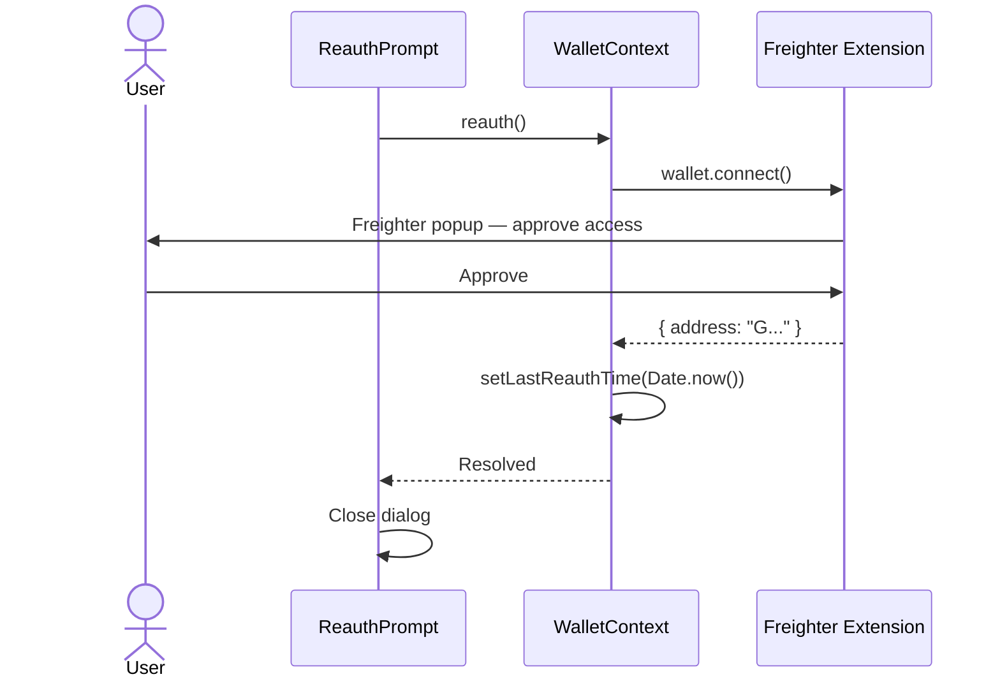
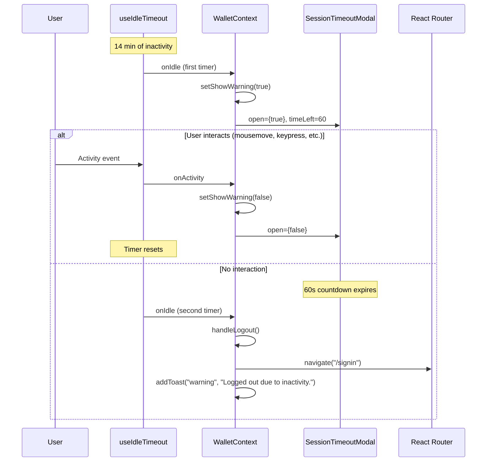

# Authentication Flows

**Audience:** Frontend contributors  
**Last reviewed:** 2026-07-26

Credence does not use username/password authentication. A user's Stellar wallet (Freighter browser extension) **is** their identity. This document describes the three session-lifecycle flows: **login (connect)**, **logout (disconnect)**, and **session refresh (re-authentication)**.

All three flows live in two layers:

| Layer | File | Responsibility |
|---|---|---|
| Low-level Freighter API | `src/lib/freighterClient.ts` | Browser-only wrappers around `@stellar/freighter-api` |
| React state machine | `src/hooks/useWallet.ts` + `src/context/WalletContext.tsx` | Exposes `connect`, `disconnect`, `reauth`, and `isReauthRequired` to the component tree |

---

## Login (Connect Wallet)

A login is a wallet connection. No credentials leave the browser — Freighter holds the private key and only returns a public address after the user approves.

**Key code paths:**

- `src/hooks/useWallet.ts:76` — `connect()` entry point
- `src/lib/freighterClient.ts:66` — `requestFreighterAccess()` prompts the user
- `src/components/ConnectWalletModal.tsx:43` — auto-closes on success

### Silent session restore

On every page load, `useWallet` tries to restore a prior session without prompting the user:

**Key code path:** `src/hooks/useWallet.ts:132`

---

## Logout (Disconnect)

A logout clears all local wallet state and stops the address watcher. It can be triggered manually by the user or automatically after inactivity.

**Key code paths:**

- `src/hooks/useWallet.ts:124` — `disconnect()` clears local state
- `src/context/WalletContext.tsx:69` — `handleLogout()` orchestrates the full logout including navigation and toast

---

## Session Refresh (Re-authentication)

The app enforces a configurable re-authentication threshold. When a sensitive action (e.g. viewing a USDC balance) is attempted and the threshold has elapsed since the last re-auth, the user is prompted to reconnect their wallet before proceeding.

### Threshold check

**Key code path:** `src/context/WalletContext.tsx:87`

### Re-authentication prompt

When `isReauthRequired()` returns `true`, a `ReauthPrompt` dialog is displayed. The user must click "Reconnect Wallet" to trigger the Freighter access prompt again.

**Key code paths:**

- `src/context/WalletContext.tsx:81` — `reauth()` reconnects and resets timer
- `src/components/ReauthPrompt.tsx:51` — dialog confirm handler

### Where re-auth is enforced

- **Balance fetches** (`src/hooks/useUsdcBalance.ts:80`) — throws `SessionReauthRequiredError` when threshold elapsed
- **Bond creation** (`src/components/CreateBondFlow.tsx:81`) — shows `ReauthPrompt` before proceeding

---

## Session Timeout (Inactivity Logout)

Independently of the re-auth threshold, the app enforces a hard idle timeout. After **15 minutes** of no user activity (mouse, keyboard, touch, scroll), a **60-second warning** is shown. If the user does not interact with the warning within that window, they are logged out.

**Key code paths:**

- `src/context/WalletContext.tsx:96` — first idle timer (14 min)
- `src/context/WalletContext.tsx:111` — second idle timer (60s warning window)
- `src/components/SessionTimeoutModal.tsx` — countdown UI

---

## Related documents

- [Wallet Integration](./WALLET_INTEGRATION.md) — `useWallet` hook API, connection state machine, UX contract
- [Cookie-Secret Rotation Runbook](./COOKIE_SECRETS.md) — Backend session/CSRF cookie secret lifecycle
- [Security Headers](./SECURITY_HEADERS.md) — Production HTTP header configuration
