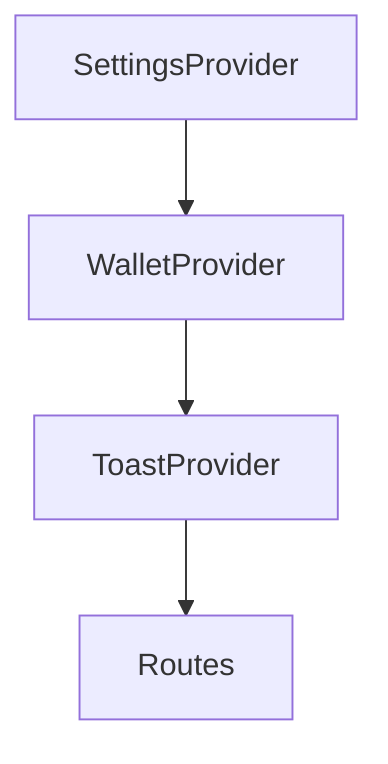
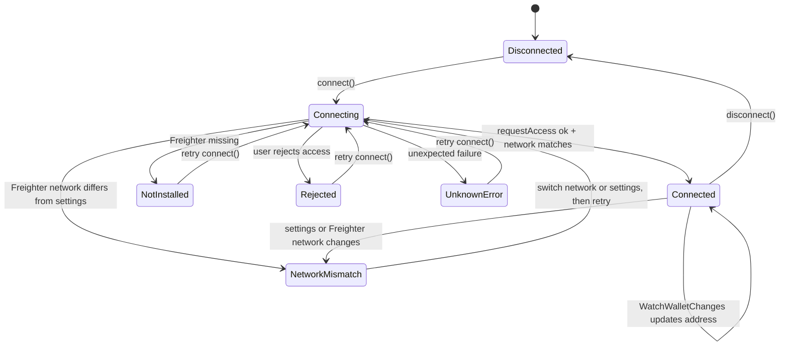

# Wallet Integration

This reference documents the current Stellar wallet layer used by Credence
Frontend. It covers the `useWallet` API, the Freighter client wrapper, the
connection state machine, and the UI contract for routes that require a wallet.

Related source:

- `src/context/WalletContext.tsx`
- `src/hooks/useWallet.ts`
- `src/lib/freighterClient.ts`
- `src/pages/Bond.tsx`
- `src/pages/TrustScore.tsx`
- `src/pages/Dashboard.tsx`

## Provider Boundary

`WalletProvider` lives inside `SettingsProvider` and outside `ToastProvider` in
`src/App.tsx`. That order is important because wallet network validation reads
the active settings network before exposing shared wallet state to route
components.



`WalletProvider` calls the hook implementation from `src/hooks/useWallet.ts` and
adds one compatibility alias:

```ts
const value = {
  ...wallet,
  connected: wallet.isConnected,
}
```

Use `isConnected` for new code. The `connected` alias exists for legacy route
consumers such as `Dashboard`.

## `useWallet` Return Shape

Consumers import `useWallet` from `src/context/WalletContext.tsx`.

| Field          | Type                  | Meaning                                                                                        |
| -------------- | --------------------- | ---------------------------------------------------------------------------------------------- |
| `address`      | `string`              | Connected Stellar public key, or an empty string while disconnected.                           |
| `isConnected`  | `boolean`             | `true` when `address` is non-empty.                                                            |
| `connected`    | `boolean`             | Legacy alias for `isConnected` exposed by `WalletProvider`.                                    |
| `isConnecting` | `boolean`             | `true` while a Freighter connection request is in flight.                                      |
| `error`        | `WalletError \| null` | Last wallet error captured by the hook.                                                        |
| `connect`      | `() => Promise<void>` | Requests Freighter access, validates the selected network, and starts the wallet watcher.      |
| `disconnect`   | `() => void`          | Stops the wallet watcher and clears local wallet state.                                        |
| `network`      | `'public' \| 'test'`  | Credence network selected in settings. Any setting other than `'test'` resolves to `'public'`. |

`WalletError.code` is one of:

- `not_installed`
- `rejected`
- `network_mismatch`
- `unknown`

The hook does not throw wallet errors to callers. It stores failures in `error`
and leaves `address` empty when a connection cannot be used.

The current source does not expose a single `status` string. When a component
needs a status label, derive it from the returned fields:

| Derived status | Condition                                                           |
| -------------- | ------------------------------------------------------------------- |
| `connecting`   | `isConnecting === true`                                             |
| `connected`    | `isConnecting === false && isConnected === true`                    |
| `error`        | `isConnecting === false && error !== null`                          |
| `disconnected` | `isConnecting === false && isConnected === false && error === null` |

## Consuming The Hook

Use the shared context hook in route components rather than importing the lower
level hook directly.

```tsx
import { useWallet } from '../context/WalletContext'

function WalletGatedAction() {
  const { isConnected, isConnecting, address, error, connect, disconnect } = useWallet()

  if (!isConnected) {
    return (
      <Button type="button" disabled={isConnecting} onClick={() => void connect()}>
        {isConnecting ? 'Connecting...' : 'Connect wallet'}
      </Button>
    )
  }

  return (
    <div>
      <code>{address}</code>
      {error && <p role="alert">{error.message}</p>}
      <Button type="button" variant="secondary" onClick={disconnect}>
        Disconnect
      </Button>
    </div>
  )
}
```

For route actions, follow the existing `Bond` and `TrustScore` pattern: if the
wallet is disconnected, call `connect()` and return before continuing the
protected action.

## Freighter Client Wrapper

`src/lib/freighterClient.ts` is the only module that talks directly to
`@stellar/freighter-api`.

| Function                        | Behavior                                                                                                                                  |
| ------------------------------- | ----------------------------------------------------------------------------------------------------------------------------------------- |
| `checkFreighterInstalled()`     | Lazily imports Freighter and checks `isConnected()`. Returns `false` when running outside the browser or when Freighter reports an error. |
| `requestFreighterAccess()`      | Calls `requestAccess()` and normalizes success, not-installed, rejected, and unknown failures into a discriminated result.                |
| `fetchFreighterAddress()`       | Uses `isAllowed()` and `getAddress()` to restore an existing allowed wallet session.                                                      |
| `fetchFreighterNetwork()`       | Calls `getNetwork()` and maps Freighter's network string into Credence's `'public'` or `'test'` values.                                   |
| `createWalletWatcher(onChange)` | Starts `WatchWalletChanges`, maps the next network, and returns a `stop()` handle.                                                        |
| `mapFreighterNetwork(network)`  | Maps strings containing `TEST` to `'test'`, strings containing `PUBLIC` or `MAIN` to `'public'`, and unknown names to `null`.             |
| `resetFreighterModuleCache()`   | Clears the lazy module cache for tests only.                                                                                              |

`FREIGHTER_INSTALL_URL` points to `https://www.freighter.app/` for UI that wants
to link users to the extension install page.

## Connection State Machine

The hook's state is derived from `address`, `isConnecting`, and `error`.



State details:

- **Disconnected**: `address === ''`, `isConnected === false`, and no connect
  request is active.
- **Connecting**: `isConnecting === true`. The hook clears `error` before it
  starts checking Freighter.
- **Connected**: `address` has the Stellar public key returned by Freighter and
  `isConnected === true`.
- **Not installed**: `error.code === 'not_installed'` and the message is
  `Freighter extension was not detected.` or `Freighter is not available in this environment.`
- **Rejected**: `error.code === 'rejected'`; `requestFreighterAccess()` detects
  rejection, denied, or cancelled messages from Freighter.
- **Network mismatch**: `error.code === 'network_mismatch'`; the hook clears the
  address during connect and keeps the error visible if an already connected
  wallet later differs from the settings network.
- **Unknown**: `error.code === 'unknown'`; used when Freighter returns no address
  or an unexpected exception occurs.

On mount, the hook attempts to restore an allowed Freighter session with
`fetchFreighterAddress()`. If the restored wallet passes network validation, it
sets `address` and starts the wallet watcher. Cleanup cancels the restore path
and stops the watcher.

## UX Contract

Wallet-dependent UI should gate the action, not the entire page, unless the
route has no useful disconnected state.

### Disconnected

- Show an action-oriented warning or empty state with a `Connect wallet` button.
- Keep explanatory content visible so users understand why the wallet is needed.
- When a protected action is clicked, call `connect()` and stop the original
  action until a wallet is connected.

Current examples:

- `Bond` shows a warning banner and changes bond actions to `Connect wallet to continue` or `Connect wallet to withdraw`.
- `TrustScore` shows a warning banner and uses `Connect wallet to continue` for the lookup button while still allowing address entry.
- `Dashboard` shows a wallet-required empty state before rendering wallet-backed dashboard cards.

### Connecting

- Treat `isConnecting` as a pending state for the connect request.
- Avoid firing duplicate protected actions while the connect request is active.
- `Dashboard` currently renders a dashboard loading skeleton while the wallet is
  connecting.

### Freighter Not Installed

- Use `error.code === 'not_installed'` to present an install or retry path.
- The current hook message is `Freighter extension was not detected.` when the
  browser extension check fails.
- Link to `FREIGHTER_INSTALL_URL` when the surface has room for an install link.

### Rejected

- Use `error.code === 'rejected'` to let users retry without treating the failure
  as fatal.
- Do not continue signing, bonding, or lookup flows after a rejected connection.

### Network Mismatch

- Use `error.code === 'network_mismatch'` to tell users whether Credence expects
  Mainnet or Testnet.
- The hook compares `fetchFreighterNetwork()` with the settings network from
  `SettingsContext`.
- The source message tells users to update Settings or switch the Freighter
  network. Keep future UI copy aligned with that recovery path.

### Connected

- Read `address` from the hook for the connected Stellar public key.
- Use shared display utilities such as `truncateAddress()` when a compact wallet
  presentation is needed.
- Keep signing and contract calls behind explicit user actions; the hook only
  connects and watches the wallet.

## Implementation Notes

- The lower-level hook is browser-safe: it returns early when `window` is
  unavailable.
- The Freighter module is imported lazily so server-like test environments do not
  load the browser extension package.
- `createWalletWatcher()` updates the address and clears stale errors when
  Freighter emits wallet changes.
- `disconnect()` clears local state only; it does not revoke Freighter
  permissions.
- The current wallet layer manages connection state only. Real contract reads,
  writes, and typed backend requests still belong behind the `src/api/` seam
  described in `ARCHITECTURE.md`.
