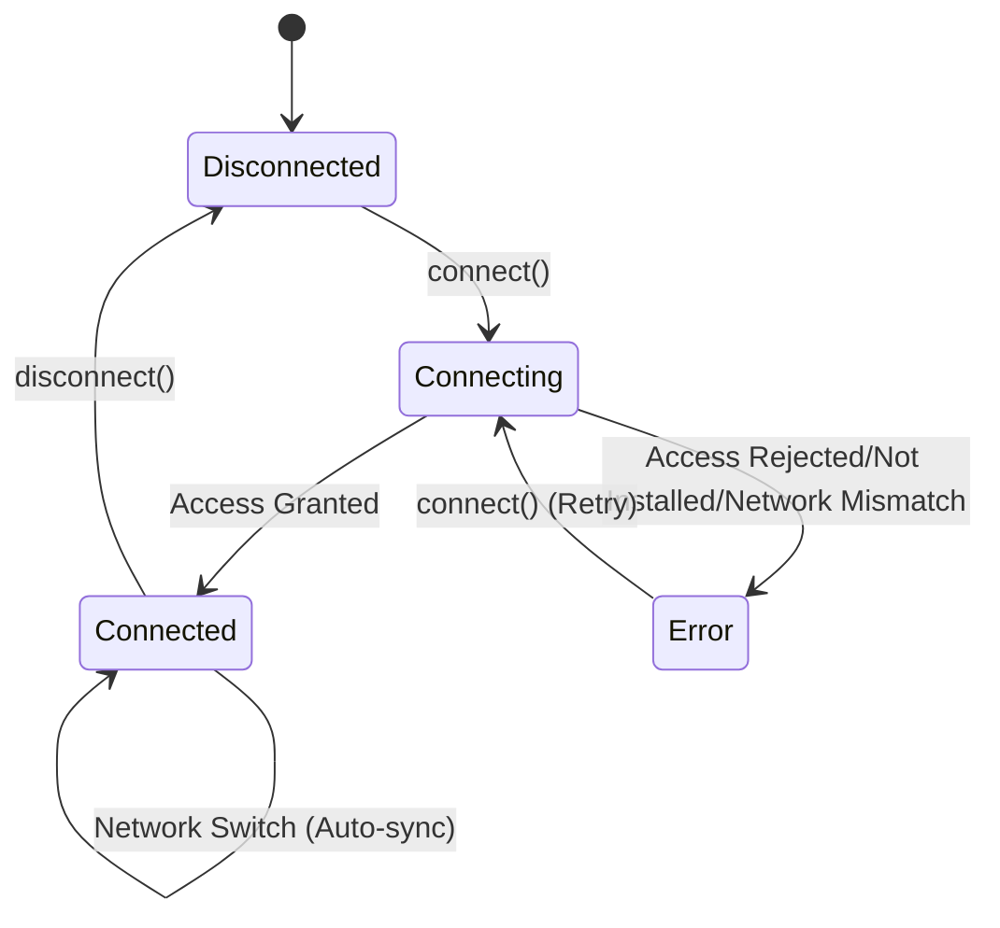

# Wallet Integration

This document outlines the wallet integration architecture, specifically the `useWallet` hook, the `WalletContext`, and the underlying `freighterClient` wrapper.

## Overview

The Credence dApp uses the **Freighter** wallet for Stellar account management and transaction signing. To ensure security and a consistent UX, all wallet interactions are gated through the `WalletContext` and exposed via the `useWallet` hook.

- **`freighterClient.ts`**: A thin, SSR-safe wrapper around the `@stellar/freighter-api`. It guards all calls to ensure they only execute in a browser environment.
- **`WalletContext.tsx`**: Provides the global wallet connection state (`WalletProvider`) to the entire application.
- **`useWallet.ts`**: The main hook for components to access wallet state and initiate connection actions.

## The `useWallet` Hook

The `useWallet` hook is the primary entry point for components to interact with the wallet.

```typescript
export interface UseWalletState {
  /** Connected Stellar public key, or empty when disconnected. */
  address: string
  /** True when a wallet address is available. */
  isConnected: boolean
  /** True while a connect request is in flight. */
  isConnecting: boolean
  /** Last connection error, if any. */
  error: WalletError | null
  /** Request Freighter access and store the returned public key. */
  connect: () => Promise<void>
  /** Clear the local wallet session. */
  disconnect: () => void
  /** Freighter network reported by the wallet, or null when unavailable. */
  network: CredenceNetwork | null
}
```

## Connection State Machine

The wallet connection follows a strict state machine to handle browser extension availability, user rejection, and network mismatches.



## UX Contract

To maintain a consistent experience, adhere to these UX rules when using wallet state:

1.  **Disconnected State**:
    - Surfaces requiring wallet action should clearly show a "Connect Wallet" state rather than an empty/loading state if `!isConnected`.
    - Do not automatically trigger the connect prompt; wait for explicit user interaction (e.g., clicking a button).
2.  **Freighter Not Installed**:
    - If `error.code === 'not_installed'`, display a clear call-to-action to install the [Freighter extension](https://www.freighter.app/).
3.  **Network Mismatch**:
    - The `network` property in `useWallet` should be compared against the application's required network. If they differ, prompt the user to switch the network in their Freighter extension.

## Consuming the Hook

```tsx
import { useWallet } from '@/context/WalletContext'

function WalletAction() {
  const { isConnected, address, connect, disconnect, isConnecting } = useWallet()

  if (isConnecting) return <button disabled>Connecting...</button>

  if (!isConnected) {
    return <button onClick={connect}>Connect Freighter</button>
  }

  return (
    <div>
      <p>Connected: {address}</p>
      <button onClick={disconnect}>Disconnect</button>
    </div>
  )
}
```

## See Also

- [Architecture Overview](./ARCHITECTURE.md) - For provider tree and context responsibilities.
- [State Management](./STATE_MANAGEMENT.md) - For broader state management practices.
